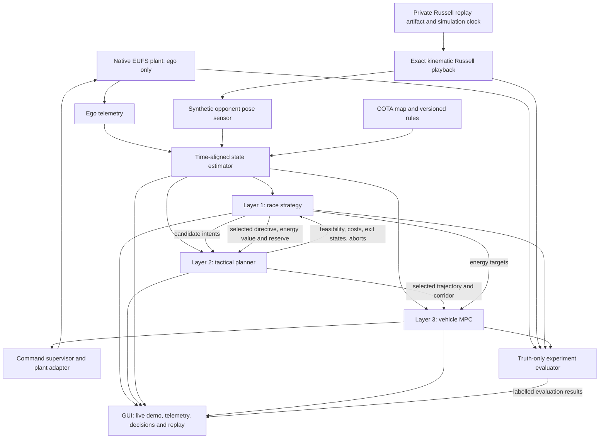

# Two-car EUFS controls and overtake intelligence implementation plan

Prepared: 2026-09-12. Status: implementation authorized and in progress; see the [implementation and review record](CONTROLS_IMPLEMENTATION_STATUS.md) for measured results and outstanding gates.

**Superseded delivery sequence:** use the [quick three-layer prototype plan](TWO_CAR_QUICK_DEMO_PLAN.md) for the current milestone. The user explicitly retains energy strategy and MPC while requesting their simplest working forms. The detailed requirements below remain the longer-term design; they must not delay the first running overtake prototype.

**Current execution priority (user clarification, 2026-09-13 local):** implement only the changes needed for the controls algorithm to work. Judge-facing presentation and further GUI development are deferred. Retain causal logging, diagnostics and headless validation needed to assess the estimator, exact opponent playback, ego dynamics and three planning layers. The GUI specification remains the later deliverable, not a prerequisite for the current algorithm milestone. **Only ego uses vehicle dynamics; Russell uses exact trajectory playback**, as explicitly confirmed by the user.

This plan implements [Energy-Aware Overtake Strategy System Design](ENERGY_OVERTAKE_SYSTEM_DESIGN.md) on the simulator described by [HANDOVER.md](../eufs-f1-sim/HANDOVER.md). The inspected parent commit is `7c08f72`, on the handover branch `feat/modular-grid-telemetry`. Existing uncommitted documents and modified nested EUFS sources are part of the starting workspace and must be preserved.

## 1. Scope and decisions

- Exactly two cars: autonomous ego `/eufs`, fixed-reference opponent `/eufs2`.
- Opponent: **George Russell, car 63, 2025 United States Grand Prix race**, confirmed by the user. Formula 1's [official classification](https://www.formula1.com/en/results/2025/races/1271/usa/race-result) lists him sixth.
- Initial data scope: **one clean representative race lap**. Use a selected section of that lap for the first judge-facing situation; retain a full-lap regression and expand the data/run length later.
- The user's clarified priority is a **repeatable scenario demo**: visibly overtake Russell along a chosen path, then add situations where the system declines or delays an overtake. This resolves the start question in favor of controlled rolling scenarios, rather than reconstructing the historical standing start.
- Ego executes all three planning layers and the native vehicle dynamics. Russell's pose follows the frozen path and pace profile exactly, advanced by simulation time. His replay model has no vehicle dynamics, tracking controller, CAN mission, hybrid powertrain or strategic response to ego.
- Use the current ROS 2 Humble / Gazebo Classic 11 system, existing dashboard, map assets, and native DynamicBicycle driving path.
- Keep the design's configurable **2026 energy/rule model** separate from the **2025 opponent recording**. This is a controlled simulation benchmark, not a reconstruction of the 2025 race or a measured 2026 COTA performance claim.
- The first milestone is an autonomous overtake demo with inspectable strategic reasoning and deep replayable logs. Driver-facing advice is derived from those decisions; a human-in-the-loop execution study follows later.
- A comprehensive GUI remains a later deliverable: every published telemetry channel and recorded decision must be discoverable, graphable or inspectable, and synchronized with the track view in live operation and recorded replay. Current implementation prioritizes the controls algorithm; preserve the data contracts needed to add these views later.

The first success is a repeatable visible pass, a feasible exit/retention, and a traceable explanation of why that path and energy commitment beat following. The next demos demonstrate declining and delaying. The stronger strategy benchmark then adds an early feasible opportunity and a better later one: ego should defer, preserve energy, pass later and improve the measured outcome against immediate-attack and fixed-deployment baselines. Decisions must emerge from validated alternatives and resource costs, not a hard-coded instruction to attack or wait in a named demo.

## 2. What exists, and what must change

These are source and saved-artifact findings. The running binary must be checked against them before implementation validation; the handover's grid image intentionally preserves an existing compiled plugin.

| Area | Inspected evidence | Consequence for this plan |
| --- | --- | --- |
| Working simulator | `HANDOVER.md`, `load_car.launch.py`, namespace-aware grid and TF helpers | Extend the current platform; two-car spawning is already available. |
| Native commands | `/eufs/cmd` and `/eufs2/cmd`, `AckermannDriveStamped`; acceleration and steering control the native model | Start with this interface. `cmd_vel` is not the native actuator interface. |
| Command dynamics | `urdf/racecar.gazebo`: 0.2 s control delay, 1 s lock-to-lock time; native plugin applies rate limiting and a command timeout | Prediction must include delayed commands and steering actuator state. Stopping is a bounded braking request, not merely `speed=0`. |
| Existing lap helper | `scripts/cota_path.py`, `scripts/cota_lap.py`; capped at 15 m/s with conservative acceleration limits | Useful regression and low-speed fallback basis; not an MPC or a validated racing-speed controller. |
| Saved lap validation | `.tmp/lap_validation/cota_lap_full.json` and `live_trace_footprint_summary.json` report a completed 5,513 m lap and no footprint violations | Preserve this behavior as a regression baseline. These are earlier results, not tests run during this planning task. |
| Battery-to-motion coupling | `eufs_models/src/dynamic_bicycle.cpp`: longitudinal force is commanded acceleration times mass minus drag; no energy/temperature input | Add powertrain limits inside the native plant. A battery display alone cannot validate energy strategy. |
| Existing electrical accounting | `mechanical_energy_consumer.cpp` differentiates world potential energy and floors consumption at idle | Flat-track acceleration and braking recovery are not accounted for correctly by that consumer. Replace its authority in the new hybrid profile. |
| Thermal accounting | `battery_discharge.cpp` subtracts cooling without multiplying that term by `dt` | Correct or replace the thermal integrator, then check timestep convergence. |
| Existing battery configuration | `forgez_battery.gazebo`: 22.2 V / 5.5 Ah pack; Forgez modes use 8–18 kW | These are not a calibrated F1 hybrid powertrain. Define a separate explicit vehicle profile. |
| Tyres | `tyre_state_publisher.py` integrates dashboard estimates; native lateral tyre force uses static coefficients | Add temperature/wear-dependent grip and combined longitudinal/lateral limits to the plant before tyre-sensitive strategy claims. |
| Public telemetry | `telemetry_schema.py`, assembled inside `StartDashboard.telemetry_frame()` | Preserve its public display contract; introduce a separate stamped estimator/planner contract. The dashboard object is not a ROS bus or operational state estimator. |
| COTA geometry | `cota/provenance.yaml`: flat, layout-reference geometry; authored constant 14 m width | Use the existing map for integration. Replay registration and all passing corridors must fit this map and its stated fidelity. |
| COTA event indexing | SVG contains 40 circles at 20 unique label centres; `_extract_turn_svg()` takes circles and the event loop uses the first 20 | Current 20 turn entries have only 10 unique progress values. Fix label extraction and validate real turn order before planning by turn name. |
| Contact/scoring | Native plugin writes model pose/velocity from its internal state | Independently detect swept vehicle-footprint overlap and track violations. Gazebo contact response cannot be assumed to validate a racing collision. |
| Build provenance | `Dockerfile.grid` rebuilds racecar/tracks while preserving the compiled native plugin; workspace contains locally patched upstream code | A controls image that changes physics must explicitly build the affected models/plugins from preserved, versioned patches. |

Earlier audit documents describe some already-repaired problems, including missing COTA and namespace collisions. Reuse their still-relevant physical findings, but do not treat all historical findings as current defects.

## 3. Architecture and execution ownership

The estimator, command supervisor, simulator, and evaluator support the **three** planning responsibilities; they are not extra planning layers.



| Responsibility | Initial rate | Horizon/output |
| --- | --- | --- |
| State estimation | 50 Hz, with sensor callbacks | Own state, opponent pose belief, uncertainty, unwrapped progress and closing speed at a common decision time |
| Race strategy | 0.5 Hz plus events | Next 2–3 meaningful opportunities, truncated at the one-lap finish; selected intent, energy price, budget, continuation reserve |
| Tactical planning | 5 Hz | Follow/left/right/defer candidates, 4–8 s trajectories, corridor, costs, abort route, expiry |
| Vehicle MPC | Start at 20 Hz; qualify 50 Hz later | Nominal 6 s prediction; feasible steering/acceleration and hybrid allocation |
| Command supervision | 50 Hz | Exclusive command ownership, freshness checks, bounded fallback and health state |
| Physical integration | Native physics update, presently configured at 1,000 Hz | Delivered forces, electrical energy, thermal/tyre states and independent hard limits |

All physical durations use simulation time. Solver runtime and process-liveness watchdogs use a monotonic wall clock. Pausing freezes the experiment; a time reset invalidates estimates, replay state, command queues, and outstanding solutions.

Use independent ROS executors/processes for optimization and control publication so a strategy or tactical solve cannot block the command watchdog. Candidate exchange is asynchronous and tagged with state revision, decision ID, generation time and expiry. Late results cannot overwrite a newer plan.

### Layer contracts

Use typed ROS messages backed by pure computational data structures. Every message carries a schema version, run/epoch ID, simulation timestamp, validity/expiry and relevant frame or map identity. Use SI internally: metres, seconds, radians, m/s, joules, watts; convert to km/h, Wh, MJ and percentages at display boundaries.

| Contract | Essential fields |
| --- | --- |
| `EstimatedRaceState` | Ego pose/velocity/acceleration, body and track speeds, covariance; absolute stored and usable energy, signed energy change, thermal/grip state and limits; opponent pose belief/history-derived speed/gap, covariance, identity confidence and freshness; lap/progress, rules and event context |
| `StrategyDirective` | Action family, target, opportunity, permitted corridor/timing, deploy/recovery budget, minimum exit energy, marginal future energy value, continuation, abort conditions, expiry |
| `TacticalEvaluation` | Candidate/state IDs, feasible/infeasible/unevaluated status, reason codes, time/resource costs, predicted exit-state uncertainty, retention evaluation, abort option, coverage and computation status |
| `TrajectoryPlan` | Time-tagged pose/Frenet state, speed, curvature, corridor and energy references, actuator/force bounds, candidate ID and expiry |
| `ControlStatus` | Tracking errors, solver status, computation time, constraint residuals, requested/delivered actuation, derates, fallback reason |
| `StrategyExplanation` | Ranked alternatives, benefit relative to next-best action, assumptions, omitted branches, predicted outcome and resource effects, separate uncertainty and search-coverage fields |

Do not infer validity from a nonzero value. Preserve unavailable fields explicitly. Physical energy, usable energy above reserve, SOC, per-lap regulatory counters, and predicted terminal energy must remain distinct. With internal discharge-positive power/current, positive `Delta_E` still means stored battery energy increased; the ROS `BatteryState` adapter documents its charging-positive current convention.

### Command and energy interface

1. During initial integration, the ego supervisor is the sole publisher to the existing native `/eufs/cmd`. Dashboard/manual requests and autonomous requests enter separate supervisor inputs. Manual takeover and stop have explicit priority and immediately cancel autonomous commitment. Russell does not subscribe to a vehicle command interface.
2. Acceleration and steering alone do not specify the ICE/MGU-K split. Add an **opt-in atomic `HybridDriveStamped` input** to the native plugin for the hybrid profile: stamped Ackermann drive request, signed requested MGU-K wheel force, decision sequence and expiry. Force-based allocation remains well-defined at low speed; electrical power and motor torque limits are checked using speed/gearing and efficiency maps.
3. In hybrid mode the supervisor publishes only `/eufs/hybrid_cmd`; the plugin selects this input exclusively. Keep `/eufs/cmd` as the legacy profile's authoritative input. Do not accept both as competing actuator owners and do not hide deployment in unused Ackermann fields.
4. The allocator treats `drive.acceleration` consistently with native semantics: a tyre-force request divided by mass, before the model subtracts drag. It splits the requested force into bounded ICE, signed MGU-K and friction-brake forces and reports what was actually delivered. Inability to meet the request produces a derate/feasibility signal rather than extra unaccounted force.
5. Clamp energy, electrical/torque/thermal/rule limits at each physics step using delivered quantities. Delay and latch steering plus hybrid allocation together. Publish `ActuationFeedback` and `EnergyState` to close the prediction loop.

This preserves the working manual/native profile while giving the new controls stack an unambiguous energy actuator.

## 4. Russell data and fixed-reference opponent

Use FastF1 as an **offline import tool**. Runtime playback must work with networking disabled.

### Data availability verified during planning

A download with FastF1 **3.8.3** succeeded for Russell's 2025 US GP race. The probe found 56 laps, of which 49 passed the clean-lap eligibility filters. Its representative candidate is **lap 28, stint 1, medium tyres, 100.499 s**. It contains 378 car-data samples and 394 position samples, with recorded speeds of **71–310 km/h**. Median sample interval is approximately 0.24 s; maximum gaps are 1.161 s for car data and 1.079 s for position data.

The [probe summary](audit/fastf1_russell_2025_usgp_probe.json) records dependency versions and exported-source hashes. This confirms data availability, not final reference quality: reject or explicitly handle the gaps, inspect the chosen demo segment, register the geometry and validate feasible pace before freezing lap 28 as the production reference. FastF1's `IsAccurate` flag concerns lap timing and does not establish high-rate position/trajectory accuracy.

The probe used a workspace-local virtual environment and did not install into the simulator or change host packages. Inherited host numerical packages produced optional binary-compatibility warnings; use a clean, coherently pinned export environment in implementation rather than inheriting host site packages. Raw cache and candidate CSVs are presently under `.tmp/controls-plan-fastf1-data/`.

Suggested import flow, with the version locked in the artifact manifest:

```python
session = fastf1.get_session(2025, "United States Grand Prix", "R")
session.load(laps=True, telemetry=True, weather=False, messages=True)
laps = session.laps.pick_drivers("RUS")
clean = laps.pick_wo_box().pick_accurate().pick_track_status("1").pick_not_deleted()
# Choose and persist one actual lap after quality checks, then extract:
car_data = chosen_lap.get_car_data()
position_data = chosen_lap.get_pos_data()
```

For a representative rolling lap, exclude race lap 1 and pit laps, reject incomplete samples, then select the actual valid lap closest to the median lap time in a declared clean stint. Persist the selection and tie-break rule. Do not average several laps into an invented historical lap. If actual race lap 1 is selected, bypass that clean-lap policy explicitly and retain its standing-start/traffic context.

FastF1 defines speed in km/h, coordinates in tenths of a metre, and separate time/source channels in its [telemetry implementation](https://raw.githubusercontent.com/theOehrly/Fast-F1/master/fastf1/core.py). Keep raw position and car channels and their timestamps before alignment. The maintainer also cautions that position data may follow a predefined line and cannot establish actual cornering line choices; see the [data-source discussion](https://github.com/theOehrly/Fast-F1/discussions/491). Therefore label the result a **Russell-paced fixed reference**, with approximate path geometry, rather than his exact measured racing line.

Processing steps:

1. Verify event/year/session, driver number and results; retain raw lap metadata, track status and source timestamps.
2. Validate coverage, monotonic time, duplicates, gaps, start/finish crossing, speed jumps and clean-lap eligibility. Record all exclusions.
3. Convert units; smooth enough for a differentiable reference without claiming interpolation adds information. Compare integrated speed distance, position distance and official timing.
4. Register the recorded loop to current COTA using direction, start/finish and ordered corner/sector landmarks. Report residuals and whether a rigid/similarity fit is adequate. A display rotation is not a world-frame transform.
5. If direct registration cannot fit the current layout safely, use monotonic progress mapping onto a fixed, boundary-feasible path in the current map. Preserve the pace profile against progress and record this geometric adaptation. Do not silently teleport points across corners or clip the car into the corridor.
6. Validate path curvature and the complete vehicle footprint. Correct turn metadata independently before assigning opportunity names.
7. Build a feasible speed profile with acceleration/braking passes, combined-grip and steering-rate checks. Preserve both raw and adapted profiles. Begin with a fixed declared pace scale when necessary, then raise it only after tracking tests. Never dynamically slow Russell because ego is failing to catch him.
8. Store time/progress/pose/curvature/speed references, source and transformed hashes, lap identity, registration quality, pace scaling, lap seam treatment, FastF1 version, and vehicle/map profile hashes.

Implement `/eufs2` as exact kinematic playback of the frozen reference, with no DynamicBicycle or feedback follower. Apply the interpolated pose at every physics update and publish matching timestamped truth. The simulation clock, run epoch and configured reference phase determine pose independently of ego. Pause freezes playback; reset explicitly reinitializes its epoch and phase; completion of the declared one-lap interval is explicit. Check visual/truth/reference agreement to numerical tolerance, including the lap seam. Initial positioning and estimator warm-up happen outside the scored interval. Future looping changes reference phase and lap accounting without resetting ego's physical resources.

Only the opponent playback component and evaluator can load the replay. The operational ego planner receives timestamped opponent **pose observations**, not the replay's future positions or direct velocity. Russell has no simulated battery, tyre dynamics or control demand. A labelled oracle may use future replay for an upper-bound comparison. Exact playback means exact reproduction of the frozen, geometrically adapted artifact; it does not upgrade FastF1's historical position accuracy. Fixed playback cannot establish performance against reactive defence; retain that limitation in every report.

## 5. Scenario demos and logging from the beginning

### Demo sequence

Freeze each scenario's initial state and source segment after a feasibility sweep. Configure the **situation**, never the action the planner must output. Start with normal estimated observations at a declared low noise/delay level; truth-only debugging remains visibly labelled.

| Demo | Setup and expected behavior | What the judges can inspect |
| --- | --- | --- |
| D1: pass Russell | Rolling approach near the repaired T11/back-straight opportunity, modest gap, sufficient deploy/reserve and grip; compare follow/left/right and execute the best feasible pass | Predicted paths, selected side, energy cost, relative progress, actual pass and exit/retention |
| D2: decline the pass | Same source segment; change a declared gap/resource/grip condition so attack is inferior or infeasible | Candidate rejection or inferior-value explanation, safe following trajectory and preserved resources |
| D3: wait, then pass | Extend the run through two genuine opportunities; early attack feasible but later continuation has better value | Both alternatives and predicted outcomes, preparation phase, later commitment and measured advantage |
| D4: cancel safely | Introduce a timestamped, recorded observation dropout or power derate during preparation | Expired assumptions, abort event, updated safe trajectory and logged reason |

D2 must distinguish **cannot pass** from **could pass, but should not spend energy now**. Build at least one example of each as the strategy model matures. D1 is the first demo to lock; D2–D4 follow without changes to the logging or control interfaces.

The initial scenario duration should be as short as the approach, manoeuvre, corner exit and retention evidence allow. Budget a roughly 30–90 second presentation, with duration determined by validated pace and optional paused replay, rather than requiring judges to watch a complete lap. Keep the full one-lap run as an engineering benchmark.

The end of a short presentation is **not the race finish**. Give each scenario an explicit remaining-race context and continuation value so the planner cannot spend all energy merely because recording ends after the pass. Only an actual configured finish removes the value of future deployment. Short-demo reports emphasize the measured manoeuvre and retained position; a full finishing-order claim requires the complete race interval.

### Demo operator and viewer flow

1. Select a named scenario and see its manifest: source lap/segment, initial gap, resource states, observation assumptions and profile versions.
2. Initialize ego's native internal state and Russell's replay phase in the configured approach, warm up the estimator, then start scoring from a shared epoch. Use an unscored rolling warm-up for ego; setting only ego's Gazebo visual pose/velocity does not initialize its dynamics.
3. Show ego and Russell in Gazebo/RViz plus labelled candidate/selected/actual path overlays, current action and a short reason in the existing dashboard.
4. Show a compact comparison table: follow, left, right or defer; feasible status, predicted time/outcome, deploy cost and exit reserve. Detailed evidence opens from the same decision ID.
5. After the scenario, show actual clearance/retention, energy spent, deviations from prediction, and a timeline. Allow synchronized replay and pause/scrub without rerunning physics.

Display an expected action only in the scenario's test definition, not as a controller input. A live run that chooses differently or fails must show the actual result. A prerecorded successful replay is explicitly marked as recorded.

### Causal logging contract

Implement this in Phases 0–1, before strategy tuning. Logging is a required part of every component, not a dashboard feature deferred until integration.

Every record includes `run_id`, `epoch_id`, `scenario_id`, simulation timestamp, monotonic wall timestamp, component, schema version and causal identifiers. Link:

```text
observation IDs → state_snapshot_id → decision_id → candidate_id
→ trajectory_id → command_sequence → actuation_feedback → outcome_event
```

| Stream | Required contents | Capture policy |
| --- | --- | --- |
| Run manifest | Parent/nested commits and dirty patch hashes, image/plugin/solver/dependency versions, map/rules/vehicle/replay hashes, scenario parameters, seed, start/finish definitions | Once plus explicit configuration-change events |
| Observations and state | Received raw ego inputs, opponent pose observations, source/receive times, TF, aligned estimate/covariance, staleness and resource limits | Every received observation and every published estimate; truth in a separate scoring stream |
| Strategy | Exact input snapshot, all generated candidates/parameter ranges, continuation horizon, outcome branches, costs and energy value, chosen action, next-best margin, exclusions and coverage | Every regular and event-triggered decision, including “no change” and “no reliable recommendation” |
| Tactical planning | All evaluated candidate trajectories/corridors, predicted opponent occupancy, feasibility residuals/reasons, budgets/exit states and abort paths | Every evaluation, expiry, cancellation and selected-plan revision |
| MPC | Reference and initial state, warm-start reference, predicted state/control sequence, status/iterations, residuals, cost terms, timing, first control and fallback | Every control solve; store full prediction arrays in compact indexed artifacts |
| Actuation and plant | Requested versus delayed/applied steering/forces, deploy/recovery, available limits, physical energy, thermal/grip states, all derates/violations | At control/feedback rate; violation detection at physics rate, with event-triggered high-rate trace buffers |
| Outcome/advice | Overlap, clearance, retention, abort, track/contact events, comparison with forecasts, advisory transitions/expiry | Every event and periodic progress summaries |
| Runtime/log health | Real-time factor, callback/solver timing, backlog, dropped observations/log records, file completeness and reset events | Periodic health plus every fault/drop |

Use ROS bags for message/clock/TF replay, append-only JSONL for causal decisions/events, and indexed numerical files for prediction arrays and derived time-series tables. Write through a separate recorder/process with bounded queues. Record queue overruns and mark an evidence bundle incomplete; disk I/O must not block the control loop. Full input snapshots plus versioned model/configuration permit decision replay without accessing hidden opponent truth.

Each run produces a self-contained bundle:

```text
run_<id>/
  manifest.json
  observations/              # operational ROS inputs, /clock and TF
  truth/                     # evaluator-only bag or numerical stream
  decisions.jsonl
  events.jsonl
  predictions/               # keyed by decision/candidate/trajectory IDs
  telemetry.parquet
  metrics.json
  report.html                # scenario, alternatives, plots and event timeline
```

Include the exact raw source artifact hash and transformed replay hash; cache paths alone are not provenance. Keep planner-internal predictions separate from later truth so post-run plots cannot make forecasts appear more accurate than they were. Report predicted counterfactuals as predictions; compare against separate identically initialized baseline runs for measured counterfactual evidence.

**Logging acceptance:** selecting any displayed action retrieves its input snapshot, alternatives and reasons, trajectory and applied controls; an offline replay reconstructs the decision timeline; pause/reset never merges different epochs; a deliberately dropped record is detectable. Log completeness is part of demo readiness alongside driving success.

## 6. Full GUI specification

The GUI is the main interface for operating, presenting and investigating the demo. Extend the existing PyQt5 dashboard foundation into modular views, retaining the working stack lifecycle and manual controls. Provide a polished **Presentation** layout for judges and an **Engineering** layout exposing the complete channel catalogue, decision history and diagnostics. Both use the same recorded evidence and selected simulation time.

### Main views

| View | Required contents and interactions |
| --- | --- |
| Scenario control | Select D1–D4 or full-lap run; inspect/edit initial gap, energy, temperature, grip, pace scale and observation noise before starting; show source lap, profile versions and expected experiment duration; Start, Pause simulation, Resume, Stop, Reset and recording status. Route driving requests through the command supervisor. |
| Live race / Presentation | Large integrated 2D circuit view with both cars, footprints, trails, turn/opportunity labels, selected and alternative paths, predicted occupancy and abort corridor; current action and plain-language reason; gap, closing speed, ego speed, energy/reserve and overtake lifecycle; compact graphs and pass/retention outcome. Keep Gazebo/RViz camera launch/follow controls available for the 3D view. |
| Telemetry explorer | Searchable catalogue of every telemetry channel; car/source/category filters; current value, units, age and validity; selectable synchronized plots, numeric/vector tables and statistics. Users can pin any supported channel to a custom layout. |
| Strategy decisions | Complete timestamped history including hold, no-change, decline, replan and abort; selected action, all evaluated alternatives, timing/energy ranges, objective contributions, continuation and terminal value, next-best margin, coverage, assumptions and uncertainty. Expand the scenario tree and see which action is common before observations distinguish branches. |
| Tactical paths | Compare follow/left/right/defer trajectories on the map and in time–distance and progress–lateral-offset plots; show opponent occupancy uncertainty, minimum predicted clearance, braking/exit feasibility, energy/reserve constraints and abort options. Selecting a rejected candidate reveals its constraint residuals and reason. |
| MPC and actuation | Actual/reference/predicted state and controls, requested/delayed/delivered commands, steering-rate/force/power limits, cross-track/heading/speed error, prediction horizon, solver status/iterations, cost terms, constraint margins, runtime and fallback. Inspect each recorded solve and its full predicted trajectory. |
| Energy and tyres | Dedicated battery/power/thermal and four-wheel plots, budgets/reserve/limits, accumulated deployment and recovery, tyre temperature/wear/grip and their effect on manoeuvre feasibility; drill down to the raw source and relevant derate/decision event. |
| Opponent and perception | Estimated opponent pose, covariance, identity, signed gap, closing speed, measurement delay/dropouts and tracking confidence. A visibly separate evaluation view may overlay evaluator-provided truth and replay tracking error; hidden opponent resources never enter the planner's observation stream. |
| Events and system health | Search/filter readiness, command ownership, control transitions, data expiry, warnings, constraint violations, resource derates, missed deadlines, dropped messages/logs, recording completeness and real-time factor; click an event to open the affected plots and decision. |
| Replay and comparison | Open a saved run without Gazebo; play/pause, scrub, step by sample or decision, jump to approach/overlap/clearance/abort/retention, adjust playback speed and bookmark moments. Compare runs/baselines aligned by simulation time, progress or event; show predicted versus executed outcomes and export plots, tables and the report. |

Presentation mode prioritizes a readable demonstration while the Engineering layout retains complete access. Labels, line styles, units, legends and status text accompany colors. Use resizable/dockable panels and saved layouts so the operator can show a map plus several graphs on a normal desktop display or move diagnostic panels to a second screen.

### Telemetry and graph coverage

Create a **channel registry** shared by the telemetry adapters, logger and GUI. Each entry declares stable channel ID, source topic/message field, car, units, scalar/vector/category shape, measurement/estimate/prediction/truth classification, timestamp, validity, expected cadence, description, and optional bounds. New published fields automatically appear in the explorer; curated panels are shortcuts into that registry.

| Channel group | Required graphs/statistics when available |
| --- | --- |
| Motion and race state | Map x/y/z, yaw, Frenet progress/lateral offset/heading error, lap and elapsed time, body and track speed, longitudinal/lateral acceleration, yaw rate, travelled distance, timing/sector deltas and footprint clearance |
| Driver requests and actuators | Requested/reference/delayed/applied steering and steering rate, acceleration, wheel/ICE/MGU-K/brake force or torque, throttle, brake and gear/DRS channels where actually supplied; per-wheel speed/RPM |
| Battery and electrical | SOC, stored/usable/reserve energy, signed Delta Energy and its rate, plan deviation, voltage, requested/delivered current, requested/available/delivered deploy and recovery power, net pack power, losses, deployment/recovery totals and lap counters |
| Thermal and resources | Pack/core/surface/cell/module temperatures where modelled, thermal and electrical limits, derate state/duration, SOH and fuel only if supported |
| Tyres and grip | FL/FR/RL/RR surface/carcass temperatures, wear, age, compound, grip coefficient/uncertainty, slip and combined-force utilization, wear rate, remaining life and calibrated lap-time degradation where available |
| Opponent and estimation | Observed/estimated position and heading, pose covariance, gap in metres and valid time-gap estimate, inferred track speed/closing speed, identity confidence, observation age, dropped samples and estimator residuals |
| Planning and execution | Candidate costs and ranking, predicted time advantage, deploy budget/exit reserve, energy price, retention estimate where calibrated, clearance/constraint margins, tracking/prediction errors, solver times/iterations/deadlines and advisory transitions |
| Experiment and runtime | Real-time factor, message rates/age, log backlog/drops, lap/scenario metrics, pass/failure/abort counts, energy/thermal/track/contact violations and baseline deltas |

Every numerical scalar gets a time-series plot; vector/array fields expose named components and appropriate vector/heatmap views. Categorical/bool fields get state timelines or event markers; nested decision payloads get a searchable structured inspector. Derived quantities must name their formula, units, source channels and validity conditions. Show min/max/mean, latest and suitable percentiles/RMS over a selected interval, with sample count and time coverage; distinguish sample-weighted from time-weighted summaries and do not compute misleading means for categorical fields.

Unsupported fields remain visible as **Unavailable**, with the missing source/model reason. Never replace missing energy, tyre, fuel, gear or DRS data with zero or a synthetic graph. Mark stale readings, preserve measured zeros, and break curves at missing samples or clock resets. Historical FastF1 channels are labelled source-reference data, distinct from currently simulated telemetry.

### Graph and decision interactions

- Linked pan/zoom, crosshair and time cursor across charts, map, event list and decision inspector. Offer time and track-progress axes, selectable history windows, per-car overlays, threshold/reserve bands and compatible-unit axes.
- Clicking any strategy/tactical decision or MPC solve pins its exact input snapshot, selected/rejected alternatives and prediction arrays. Subsequent live telemetry must not overwrite the evidence for the pinned decision. A clear Return to live action restores the latest state.
- Overlay predicted trajectories only from the selected decision's generation time; plot later actual measurements separately. Include uncertainty bands and available-limit curves where supplied.
- Make all generated/evaluated candidates discoverable, including infeasible, unevaluated, cancelled and expired candidates. Group repeated unchanged decisions visually while retaining every timestamp and record for expansion/export.
- Allow event bookmarks, annotations and a presentation sequence that jumps between preparation, candidate selection, execution and retention. Annotations do not modify source logs or imply decisions the planner did not make.
- Export the selected interval, plot image and underlying samples with run/decision IDs, units, source labels and profile versions. The GUI must open the full report and raw structured record without requiring terminal commands.

**Freeze view** pauses the display/history cursor; **Pause simulation** explicitly pauses the live experiment. Recorded replay is clearly labelled and disables live driving commands. Changing initial conditions creates a new run manifest; any permitted live intervention becomes a timestamped event so comparisons remain reproducible.

### GUI data flow and responsiveness

Add a dedicated `eufs_race_gui` package using the existing Qt foundation, with reusable map/plot/table/inspector widgets and live/replay data-source adapters. Move reusable display logic out of the large dashboard module while keeping a compatibility entrypoint. Existing lifecycle controls communicate with the managed stack; command requests go to supervision, never directly from a new graph/view to the vehicle.

The GUI consumes timestamped state and decision records; it does not own estimation, optimization or authoritative logging. A worker receives live ROS data and queries recorded history, while the UI thread renders immutable snapshots. Repainting, resizing, loading a report or scrubbing history must not block the control loop. Feed evaluator truth through a separate display adapter with a persistent source label; toggling its visibility cannot change what ego knows.

Initial engineering targets: 20 Hz visible map/telemetry updates and 10–20 Hz graph redraw, with display latency below 200 ms at p95 on the intended demo machine. These are UI targets, independent of sensor/control rates. Use bounded recent-history buffers, indexed disk access, virtualized event tables, and visible-range rendering/decimation that preserves spikes and state transitions. Retain full recorded sample/event resolution for inspection and export; a slower redraw never means decisions or samples may be silently discarded.

### GUI acceptance and delivery gates

1. **Coverage:** every registered telemetry field and decision record is accessible; each numeric field can be plotted, categorical field inspected as a timeline, and unavailable field explained. Keep an automatically checked channel-to-view coverage inventory.
2. **Traceability:** selecting an action shows its exact observations/state, alternatives/reasons, path, commands and measured outcome; selecting a telemetry event opens associated decisions when present.
3. **Synchronization:** map, graphs and decision inspectors agree on run/epoch/time; multi-rate streams expose alignment/interpolation; pause, missing data and backward clock jumps cannot fabricate continuity.
4. **Live/replay parity:** the same run at the same timestamp shows the same values, decisions and paths in live history and offline replay. Replay remains usable without the simulator or internet.
5. **Performance:** a full-lap recording with all channels and control solves remains searchable and scrubbable within a bounded memory budget; graph interaction and recording do not cause control deadline regressions. Benchmark with the presentation layout and engineering layout separately.
6. **Demo readiness:** at 1080p, the judges can read the selected action/reason, compare candidate paths and key graphs, see the actual pass/decline/abort, and jump to a logged explanation. The operator can prepare/run/reset the scenario and export its evidence entirely through the GUI.

Deliver the GUI incrementally: **Phase 1** channel explorer/live graphs/event timeline and replay foundation; **Phase 2** map and scenario controls; **Phase 3** energy/tyre panels; **Phases 4–6** MPC, tactical and strategy inspectors respectively; **Phase 7** presentation layout, baseline comparison, export and complete coverage/performance qualification. The first locked demo includes the GUI; it is not complete with only terminal logs and vehicle motion.

## 7. Dependency-ordered implementation

Each phase should be a reviewable change with the following exit criteria. Some offline preparation can proceed independently, but energy strategy results depend on physical validation.

The user has requested fewer, larger reviews: agents complete coherent components before primary review, with approximately half the previous review frequency. Review and required execution checks happen at completed layer milestones and integration/driving gates, rather than during individual edits.

### Phase 0 — Preserve and reproduce the working baseline

- Record parent/nested revisions, local patches, image digests, native plugin hashes, configuration and existing validation artifacts. Resolve source/image differences before attributing behavior to inspected code.
- Add a separate controls build profile that installs new packages and rebuilds changed native models/plugins. Preserve the current image and wheel-animation patches.
- Add an isolated two-car launch configuration and headless test runner. In implementation testing, isolate both ROS domain and Gazebo master from any operator's session.
- Define scenario manifests, run IDs and an initial recording bundle before collecting baseline runs.

**Exit:** the unchanged native model completes the existing regression run from the reproducible image; ego mission readiness and opponent playback readiness are checked independently; no competing backend or command publisher. The preserved two-native-car readiness test is baseline evidence, not the new controls architecture.

### Phase 1 — Contracts, estimator and exclusive control

- Create the messages and ROS-independent state/geometry interfaces above.
- Build the causal recorder, source/state identifiers and offline input replay. Every subsequently implemented planner/controller emits the required decision and prediction records from its first runnable version.
- Build the GUI channel registry, telemetry explorer/graphs, event timeline and live/replay adapters. Add display coverage with each new message/field.
- Extract reusable telemetry ingestion from the GUI dependency; keep existing dashboard output backward-compatible.
- Transform each car's odometry through its own TF chain at the measurement timestamp. Native odometry is spawn-relative; map-frame equality cannot be assumed across cars.
- Implement buffered time alignment, covariance-aware opponent tracking, continuous progress and lap accounting. Define `g = S_opponent - S_ego`, `closing_speed = -dg/dt`; expose short wrapped proximity separately from race classification.
- Add a synthetic pose sensor with configurable delay, noise, dropout and a deterministic seed. It is the only operational bridge from opponent truth.
- Implement ego manual/autonomous/fallback/stop arbitration, ego mission and opponent playback readiness, stale-state rejection and reset handling.

**Exit:** offline trajectory tests cover lap seam, lapped cars, nearby parallel track sections, stale/out-of-order samples, pause/reset and positive closing-speed convention. Commands have exactly one owner. Removing observations causes a controlled fallback rather than an attack using stale state.

### Phase 2 — Circuit events and a deterministic opponent

- Fix SVG turn-label deduplication and validate numbers against ordered landmarks; update both canonical and packaged metadata. Correcting label locations must not gratuitously change the working track geometry.
- Author event windows with entry/exit progress and feasible corridors: start/finish-to-T1 opportunity, T11 exit/back straight/T12 opportunity, and a braking recovery section. Validate these locations on the repaired map.
- Build the FastF1 exporter, source-quality report and frozen one-lap artifact.
- Implement exact kinematic playback for `/eufs2`, simulation-clock/run-epoch synchronization, matching visual and truth poses, and configurable initial phase/separation. Do not spawn the opponent with the native vehicle plugin or a tracking controller.
- Add the GUI scenario setup, integrated circuit map, car trails and source-reference/registration inspection.

**Exit:** opponent completes the declared lap without footprint/track violations; reference is reproducible from the cached artifact; playback pose and timestamps match the reference to a declared numerical tolerance at physics updates; pause/reset/seam behavior is deterministic; replay has no dependency on ego position or network availability.

### Phase 3 — Credible hybrid and tyre dynamics

- Implement a small C++ model library and native-plugin hook so the force allocator and resource integrators execute in the physics update. Keep a reduced, numerically checked equivalent for planning.
- Add calibrated/configurable ICE tractive-power and low-speed force limits, MGU-K torque/power maps, efficiencies, drag and rolling resistance. Confirm wheelbase, CG reference, axle loads and yaw inertia against the visual/model frames; do not silently replace parameters with generic F1 values.
- Integrate energy from **delivered** motor mechanical power and losses. Add physically bounded regeneration, friction-brake blending and auxiliary consumption. Energy depletion removes electrical assistance while ICE propulsion remains available.
- Add a lumped thermal model with timestep-consistent cooling and continuous derating. Separate physical store limits from rule counters and reset counters only at valid lap events.
- Feed reversible tyre temperature and irreversible wear into longitudinal/lateral grip and combined-slip limits. Publish model truth and estimator uncertainty separately; no calibrated lap-time degradation claim until measured.
- Disable the old potential-energy consumer and competing tyre/battery authority for this hybrid profile. Supply compatible dashboard adapters from the new authoritative state.
- Version the vehicle configuration independently of the 2026 rules configuration. Missing circuit-specific overtaking parameters disable that rule feature or select an explicitly synthetic benchmark profile.
- Add the complete energy/thermal/four-wheel GUI panels, requested-versus-delivered plots, limit bands and resource/derate event links.

**Exit:** flat acceleration, constant-speed drag, coast-down, braking recovery, full/depleted battery and hot-pack tests balance energy within a declared numerical tolerance. A depleted/hot pack measurably limits acceleration. Full battery prevents excess recovery. Grip loss affects braking/cornering. Repeating tests at smaller timesteps converges. No battery or tyre state resets at a lap boundary.

### Phase 4 — Vehicle MPC on a single car

- Start with CasADi model definitions and an offline nonlinear solve to verify prediction and constraints. Target generated acados SQP/RTI code for the online controller; its [official documentation](https://docs.acados.org/) describes nonlinear optimal-control and code-generation support. Pin the tested solver version in the image.
- State includes track position/lateral error/heading, longitudinal and lateral velocity, yaw rate, actual steering, energy and the relevant thermal state. Include the 0.2 s delayed input history. Slow tyre states enter the short-horizon model as updated parameters/predictions.
- Optimize steering rate, requested longitudinal force/acceleration and signed MGU-K allocation; enforce steering, combined tyre force, boundary corridor, power, energy, thermal and rate constraints.
- Start with a **6 s horizon and 50 intervals**: 20 × 0.05 s, 20 × 0.10 s, 10 × 0.30 s. Check interpolation/swept footprints between nodes and integration accuracy over coarse intervals.
- Track the tactical reference while minimizing time/tracking/control costs plus the strategy's energy price. Enforce minimum exit energy as a constraint. At the one-lap finish use the actual terminal objective; do not retain energy for a nonexistent following lap.
- Warm-start, check solver residuals, revalidate before publication, and reject expired solutions. Benchmark on the intended container/hardware at 20 Hz; qualify 50 Hz only after measured deadlines pass.
- Retain bounded braking and a separately validated tracking/following fallback inside its speed envelope. A solver failure at racing speed cannot be delegated blindly to the 15 m/s demonstration controller.
- Add the MPC/actuation GUI inspector with every solve, predicted-versus-actual plots, residuals, timing and fallback diagnostics.

**Exit:** single-car full-lap tracking passes at the declared pace and energy settings; prediction error and actuator delay are characterized; faults trigger timely fallback. Initial target at real-time factor 1: 20 Hz with p99 controller computation below 40 ms and every deadline miss logged/handled. These are acceptance targets, not current performance measurements.

If an OSQP implementation is selected later, it must solve a valid convex QP with linear constraints, as documented by [OSQP](https://osqp.org/docs/); it cannot directly solve the nonlinear racing problem or an SOCP.

### Phase 5 — Tactical manoeuvres and feedback to strategy

- Generate genuinely different follow, left-pass, right-pass, defer and abort paths in Frenet coordinates, with timing and energy-budget variations.
- Predict opponent occupancy from the estimated state/history. Inflate footprints for uncertainty and latency; use branch-aware trajectory checks as observation fidelity expands.
- Check approach, overlap, full clearance, braking, corner exit, return/follow continuation and abort feasibility under the same vehicle/resource limits as the controller.
- Return explicit infeasibility reasons: corridor too narrow, no braking room, power/exit reserve insufficient, grip/thermal limit, stale perception, deadline exhausted. Keep unevaluated distinct from infeasible.
- Revalidate committed candidates every tactical tick; send an updated feasible trajectory or cancel commitment.
- Add the tactical GUI inspector for every candidate path, occupancy/corridor, feasibility result, constraint margin and abort option.

**Exit:** scripted left/right passes and deliberate aborts succeed only when feasible, with zero footprint/track violations. Blocked corridors, stale opponents and low energy are rejected for the correct reason. Tactical costs and exit states are compared with executed results.

### Phase 6 — Race strategy and the value of waiting

- Build an event-based finite dynamic programme/scenario tree with progress, energy, gap, grip/tyre state and laps remaining. For this fixed opponent, start with one behavior model plus state/execution uncertainty; retain an extensible response interface for later reactive opponents.
- Evaluate follow efficiently, recover, close, prepare, attack left/right, defer and defend/retain where meaningful. Ask the tactical layer for feasibility and costs; compare continuations through the next opportunity/retention zone.
- Use expected remaining race time as an initial interpretable value model, subject to finishing/feasibility requirements; report two-car classification independently. Preserve the design's later win/finish/position policy as a separately configured objective.
- Derive marginal energy value from the continuation value, with consistent units, and send both the soft energy price and hard deploy/exit-reserve limits downstream. Avoid counting energy cost twice when its race-time consequence is already in the rollout.
- Use the true finish terminal condition for one lap. For expanded races, introduce and validate the continuation value beyond the explicit 2–3 opportunity horizon.
- Commit only the next action; add hysteresis and triggers for gap/window entry, model disagreement, derate, changed feasibility and pass completion. Conditional branches share a current action until a distinguishing observation arrives.
- Compare the candidate selector against exhaustive enumeration of the **same declared small abstraction**. Report abstraction size, coverage, regret and omitted actions rather than claiming continuous global optimality.
- Add the strategy decision history, alternatives table, scenario-tree/continuation view and linked graph explanations for attack, hold, defer and abort decisions.

**Exit:** a scenario sweep contains a reproducible case where waiting for a later pass wins on measured race outcome/time; predictions explain the choice and agree sufficiently with rollout measurements. A contrary case must also allow an early attack, proving the planner has not merely learned a fixed wait instruction.

### Phase 7 — Lock the first judge-facing demo, then expand scenarios

- Complete the full GUI specification in Section 6: Presentation and Engineering layouts, channel/decision coverage, linked plots/map, full inspectors, baseline comparisons, evidence export and live/replay parity. Validate responsiveness with all required streams recorded.
- Generate `MONITOR → PREPARE → COMMIT → COMPLETE/ABORT` advice from strategic counterfactuals. Include validity, cancellation and expiry; keep detailed uncertainty separate from concise driver guidance.
- Add one entrypoint/config to select D1 or a full-lap engineering run using the frozen Russell artifact, map/vehicle/rules profile, initial energy/temperature/grip/gap, seed and observation mode. Start scoring only after both cars and all required states/references are ready.
- Record truth separately from operational inputs, along with commands, plans, solver diagnostics, source hashes and run configuration. Produce a report without needing the GUI.

**Exit:** the GUI and headless entrypoint both reproduce D1 with an actual visible pass, complete causal logs, telemetry graphs, candidate/selected path overlays and replayable explanation. All Section 6 GUI gates pass. Ten repeated runs from the frozen deterministic configuration complete without collision/track violations; then test declared noisy seeds. Preserve a full-lap regression. Add D2–D4 using the same stack and evidence viewer. Pause/resume, manual takeover, shutdown, stale data and controller failure have defined, recorded outcomes.

## 8. Validation and scoring contract

Before tuning, freeze vehicle footprint, initial conditions, rolling/standing-start convention, common finish line, lap counting and thresholds in the scenario manifest. Warm-up is unscored; final classification uses progress and finish crossing in a common race frame, not each car's independently reset travelled distance. Reaching the maximum wall-time is a DNF/timeout, not completion.

Initial engineering targets for the adapted profile: zero swept-body overlaps and track-boundary violations; ego lateral tracking p95 ≤ 0.5 m and maximum ≤ 1 m on the validated reference; Russell visual/truth/reference pose agreement within 1e-6 m and yaw within 1e-6 rad at the same physics timestamp; no hard ego energy/thermal/rule-limit breaches. Separate transport latency from playback error by comparing equal timestamps. Freeze the reference interpolation and clock convention before comparing planners. Report actual values and model fidelity with every run.

Use a separate evaluator to detect pass initiation, overlap, full-body clearance, corner exit and retained position. A retained pass requires clearance maintained through the declared retention event/window, with legal trajectory and no contact; merely swapping centre-point order is insufficient. Finish-line position and retained-pass metrics are separate, especially for a late final-lap move.

Compare under identical opponent artifact, initial state, vehicle model and observation seed:

1. Fixed deployment map plus reference tracking.
2. Always attack when a gap threshold is met.
3. Gap threshold plus battery threshold.
4. Energy-aware tactical/MPC control without global strategy.
5. Complete three-layer stack.
6. Clearly labelled truth/future-replay oracle.

Report finishing order/time and completion rate, retained/failed/aborted passes, total deployed/recovered energy, finish reserve, physical/rule violations, thermal derates, tyre state and limits, tracking error, missed deadlines, prediction error and advice churn. Include paired seed runs with uncertainty intervals once synthetic observation noise is enabled.

Required scenarios include an easy pass, a blocked pass, early-pass-versus-later-pass tradeoff, low energy, hot pack, reduced grip, lap seam, stale opponent pose, replay deviation and solver overrun. Fixed playback may regain position through its pace after an ego mistake, but this does not test reactive defensive intent.

## 9. Proposed repository layout

```text
eufs-f1-sim/
  overlay/
    eufs_control_msgs/        # ament_cmake message definitions
    eufs_race_control/        # ament_python package; pure core plus thin ROS nodes
      eufs_race_control/
        contracts/ geometry/ estimation/ replay/
        strategy/ tactical/ mpc/ supervision/ evaluation/ logging/
      config/                # two-car scenario, vehicle/rules references, rates
      launch/
    eufs_hybrid_model/        # C++ powertrain/energy/tyre model and tests
    eufs_race_gui/            # modular Qt presentation/engineering application
      eufs_race_gui/
        sources/ registry/ models/ widgets/ views/ replay/ export/
      config/                # saved layouts and presentation presets
      tests/                 # coverage, time alignment, replay and UI checks
    patches/                 # reproducible native EUFS integration patches
    eufs_racecar/             # focused launch/dashboard/URDF integration
    eufs_tracks/             # corrected events and source provenance
  scripts/
    export_fastf1_reference.py
    run_two_car_benchmark.sh
    analyze_two_car_run.py
  data/opponents/             # manifests and small approved processed artifacts
  tests/                     # contract, geometry, estimator and integration tests
  Dockerfile.controls        # explicit native rebuild and pinned dependencies
docs/
  TWO_CAR_CONTROL_ARCHITECTURE_PLAN.md
  validation/                # durable benchmark summaries, when implemented
```

Large caches, raw downloads and solver build outputs stay outside tracked source. Keep FastF1/pandas imports out of the online control processes. Use the current asset resolver and grid/TF helpers; do not make a second independent map coordinate convention.

## 10. Rules, deferred work and implementation boundary

The design pins [2026 Technical Section C, Issue 20](https://api.fia.com/system/files/documents/fia_2026_f1_regulations_-_section_c_technical_-_iss_20_-_2026-08-05.pdf) and [Sporting Section B, Issue 08](https://www.fia.com/system/files/documents/fia_2026_f1_regulations_-_section_b_sporting_-_iss_08_-_2026-08-05_7.pdf). Store downloaded checksums, article references, parameter units and event-specific overrides when implementing the rules engine. Physical vehicle assumptions are independently versioned. Do not translate 2025 DRS recordings into 2026 Overtake activation.

Reactive opponents, actual detector integration, pits, flags/neutralisations, human reaction/adherence studies, surveyed COTA geometry/elevation and multi-car scale-up follow the initial demo and one-lap benchmark. Their interfaces are anticipated, but their outcomes cannot be claimed from a fixed Russell replay.

The current implementation order is **baseline/recording → interfaces/estimation → circuit/exact Russell playback → ego physical coupling → MPC → tactical planning → strategy → headless D1 and one-lap validation**. Include causal logs and algorithm diagnostics at every step. GUI work described in the phases above is deferred to the later presentation milestone, followed by additional situations. The user has authorized implementation with Luna agents writing code and the primary agent reviewing and validating each layer. Preserve the recovery snapshot and validate runtime changes in the isolated controls environment before replacing the canonical simulator.
